# KLEF CSAS — Course Section Allocation System

KLEF CSAS is the university's internal system for defining courses, collecting
per-department student demand, and turning that demand into a validated
section allocation — with a full audit trail from "a department offers a
course" all the way to "sections are finalized and locked."

It is built as three connected modules on one Next.js application:

| Module | Name | What it does |
|---|---|---|
| **1** | Course Master / Course Definition | Departments define the courses they offer (code, credits, category, coordinator, who it's offered to). |
| **2** | Course Selection & Demand | Departments select courses offered to them and submit a student count for each. |
| **3** | Section Allocation & Live Calculation | The Timetable Admin turns submitted demand into sections, clusters, and a finalized, auditable allocation matrix. |

<p align="center">
  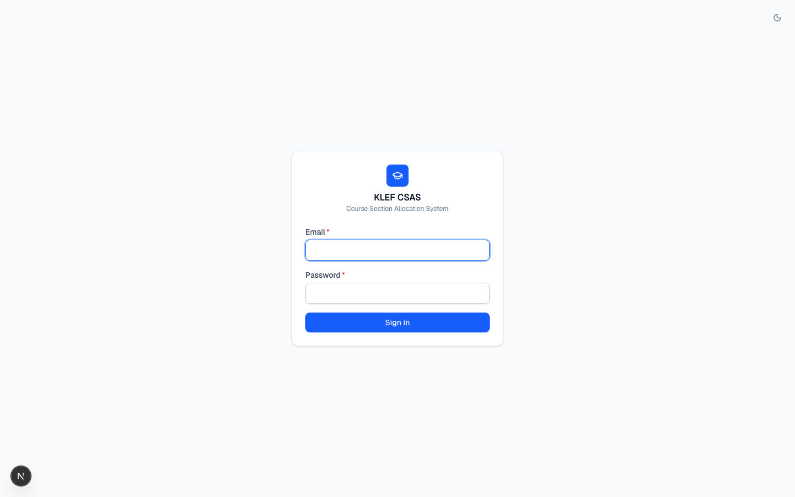
  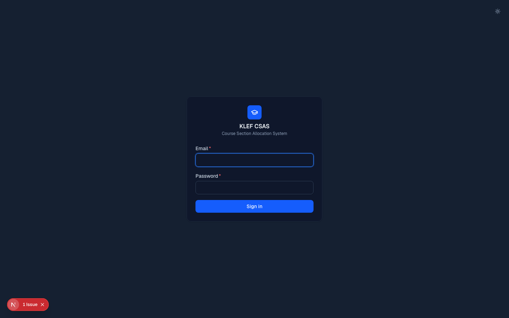
</p>

---

## Contents

- [Overview](#overview)
- [Tech stack](#tech-stack)
- [Roles & access](#roles--access)
- [Site map](#site-map)
- [Module 1 — Course Master / Course Definition](#module-1--course-master--course-definition)
- [Module 2 — Course Selection & Demand](#module-2--course-selection--demand)
- [Module 3 — Section Allocation & Live Calculation](#module-3--section-allocation--live-calculation)
- [Dark theme](#dark-theme)
- [Data model](#data-model)
- [Getting started](#getting-started)
- [Demo credentials](#demo-credentials)
- [Project structure](#project-structure)
- [Security notes](#security-notes)

---

## Overview

Every academic department at KLEF — including sections that used to be
treated as "sub-units" of a bigger department, like **CSE-1 / CSE-2 / CSE-3 /
CSE-4** or the honors tracks **HTE / HTR / HTI** — is modeled as its own
**independent department** with its own login. There is no parent/child
department hierarchy anywhere in the system: CSE-1 is not a unit of "CSE," it
is a department in its own right, and its data (courses, demand, section
rows) is never merged into anyone else's.

A single department login covers **both** Module 1 and Module 2 — the same
person who defines a course for their department is the one who later
submits that department's demand for courses (their own or anyone else's).
There is no separate "course owner" role. The only other role is the
**Timetable Admin**, who owns Module 3 end-to-end, and the **Super Admin**,
who administers shared master data (departments, categories, regulations,
semesters, course types) and has full oversight of the course catalog.

The whole flow, end to end:

```
Department A defines a course (Module 1)
        │  → sets "Offered By" (itself, locked) and "Offered To" (any other departments)
        ▼
Department A and every "offered to" department each see it in Module 2
        │  → each independently enters a student count and submits
        ▼
Timetable Admin sees all submitted demand consolidated by course (Module 3)
        │  → same course across departments combines into one allocation group
        │  → same category but a *different* course never combines
        ▼
Live calculation: grand total → required sections (CEILING) → 50:50 clusters
        │  → specialization → cluster mapping (free text, per department)
        │  → editable Department × Section matrix, 8-point live validation
        ▼
Finalize → snapshotted, audited, locked (Reopen available to Timetable Admin)
```

---

## Tech stack

- **Next.js 16** (App Router, Turbopack) + **TypeScript**
- **Tailwind CSS v4** — class-based dark mode (`@custom-variant dark`)
- **MongoDB** + **Mongoose 9**
- Edge-safe session auth: **scrypt** password hashing (Node `crypto`) +
  **HMAC-SHA256** session tokens (Web Crypto, works in `proxy.ts` middleware),
  httpOnly cookie
- **Zod** for input validation, **PapaParse** for CSV import/export
- No external UI kit — a small hand-built component library
  (`src/components/ui`) shared across all three modules

---

## Roles & access

| Role | Logs in as | Can access |
|---|---|---|
| **SUPER_ADMIN** | A named person (e.g. `ramesh.babu@kluniversity.in`) | Master data admin: Departments, Course Categories, Regulations, Semesters, Course Types, full Course Master (any department), dashboard |
| **DEPARTMENT_USER** | One login per department (e.g. `hod.cse1@kluniversity.in`) | Module 1 (their own department's courses only) **and** Module 2 (demand for courses offered to them or by them) — same session, same login |
| **TIMETABLE_ADMIN** | A named person (e.g. `lakshmi.priya@kluniversity.in`) | Module 3 in full: Consolidated Demand (read-only, all departments) + Allocation Dashboard (create/edit/finalize/reopen) |

Every server-side route re-derives the caller's department (or role) from the
**signed session cookie** — never from the request body or a query
parameter. A department cannot spoof another department's ID when creating a
course, editing a course, or submitting demand; this is enforced in the API
route handlers, not just hidden in the UI.

---

## Site map

### Public

| Route | Description |
|---|---|
| `/login` | Single login form for every role; redirects to the right home page per role after sign-in |

### Super Admin

| Route | Description |
|---|---|
| `/` | Dashboard — course/master-data counts |
| `/courses` | Course Master — every course, any department, full CRUD + CSV bulk import |
| `/departments` | Manage departments (add/edit/activate/deactivate) |
| `/course-categories` | Manage course categories (BSC, PCC, PEC-1…5, OE, AUC, …) |
| `/regulations` | Manage regulations (e.g. R-2024) |
| `/semesters` | Manage semesters 1–8 |

### Department User (one login = both modules)

| Route | Module | Description |
|---|---|---|
| `/department/dashboard` | — | This department's demand at a glance (draft/submitted/pending counts) |
| `/department/courses` | 1 | **Course Definition** — courses this department offers; "Offered By" is locked to the session's department |
| `/department/demand` | 2 | **Course Selection & Demand** — every course visible to this department (its own + offered-to), enter/submit a student count |
| `/department/demand/[courseId]` | 2 | Single-course demand entry / edit page |
| `/department/submitted` | 2 | Read-only list of this department's submitted (locked) demand |

### Timetable Admin

| Route | Description |
|---|---|
| `/admin/consolidated-demand` | Read-only, all submitted demand grouped by course then department |
| `/admin/allocation` | Allocation Dashboard — one row per course with submitted demand |
| `/admin/allocation/[groupId]` | Allocation detail: live calculation, cluster/specialization config, editable matrix, validation, finalize/reopen, CSV reports |

`proxy.ts` (Next's middleware) enforces every one of these boundaries
server-side on every request — a department session hitting `/departments`
(Super Admin) or `/admin/allocation` (Timetable Admin) is redirected away
before the page ever renders.

---

## Module 1 — Course Master / Course Definition

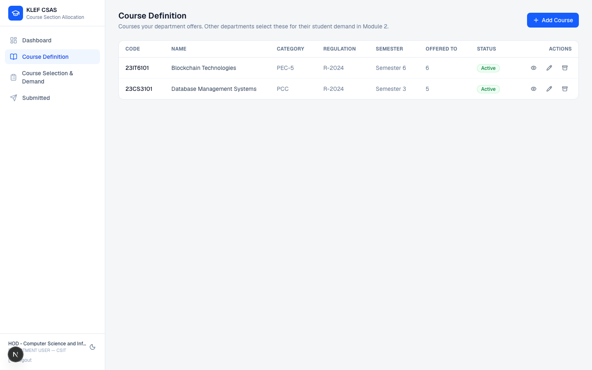

A department's Module 1 screen (`/department/courses`) lists only the
courses **that department created**. Super Admin's `/courses` is the same
underlying data, unrestricted, with search/filter/pagination and CSV bulk
import for master seeding.

<p align="center">
  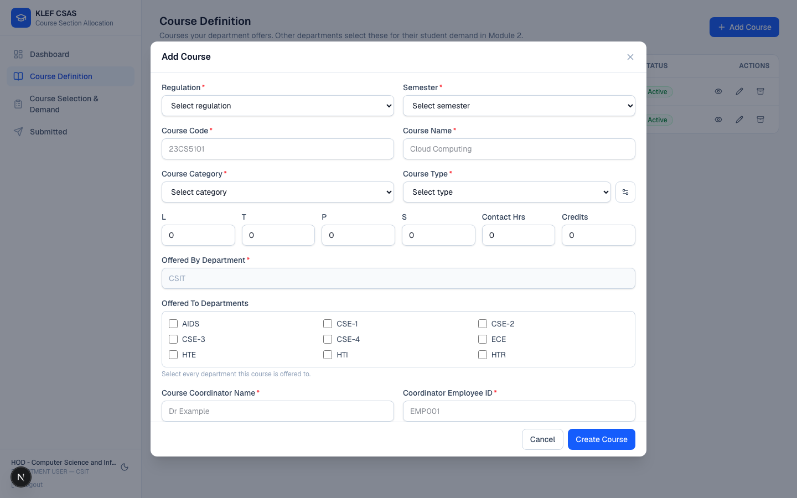
</p>

Creating or editing a course:

- **Offered By Department** is shown but **disabled** for a department
  login — it's set to the session's department server-side and cannot be
  changed by editing the request. A Super Admin, by contrast, can pick any
  department (they're doing catalog administration, not claiming ownership).
- **Offered To Departments** is a plain multi-select checkbox grid of every
  *other* active department — no units, no sub-department picker. Selecting
  none is allowed (a course can exist only for the creating department's own
  use).
- Fields: Regulation, Semester, Course Code, Course Name, Course Category, L
  / T / P / S, Contact Hours, Credits, Course Type, Course Coordinator +
  Employee ID.
- Archiving a course is a **soft delete** (`status: Archived`) — it disappears
  from active selections but the academic record and any historical demand
  tied to it are preserved.
- Super Admin also has **CSV bulk upload**: preview + row-level validation +
  a downloadable error CSV for anything that fails, so a large catalog can be
  loaded in one pass.

---

## Module 2 — Course Selection & Demand

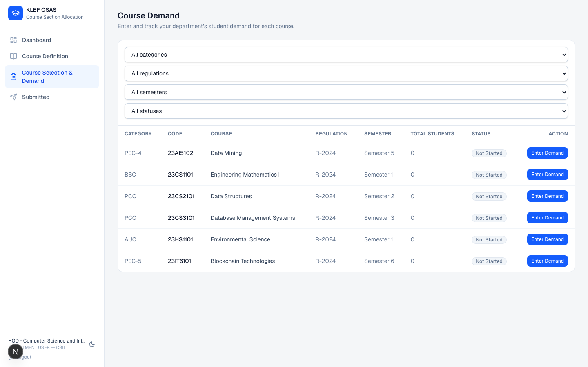

`/department/demand` shows every course visible to the logged-in department:

```
visible  =  offeredByDepartment == myDepartment
            OR myDepartment ∈ offeredToDepartments
```

— i.e. a department always sees the courses it created itself, plus anything
explicitly offered to it. This is enforced server-side in the API route, not
filtered client-side.

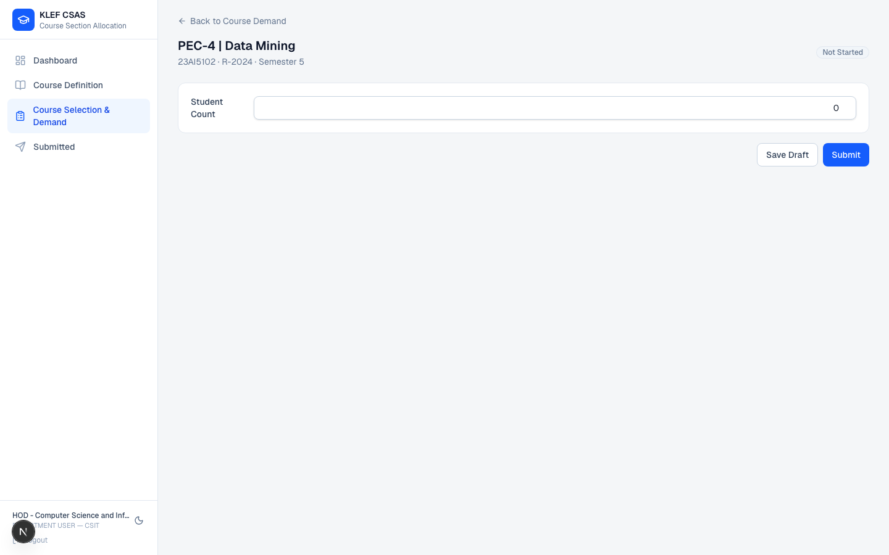

Opening a course shows one thing: a **Student Count** field for that
department. (Earlier drafts of this system modeled department demand as a
breakdown across sub-units — that concept is gone. CSE-1, CSE-2, HTE, HTR are
each already an atomic department, so one number *is* the department's full
demand for that course.)

- **Save Draft** — persists the count, stays editable.
- **Submit** — locks it. A locked ("SUBMITTED") record can no longer be
  edited by the department; only a **Timetable Admin can Reopen it**
  (from Consolidated Demand), which flips it back to editable and notifies
  nothing automatically — the department has to notice and resubmit.
- Duplicate demand for the same course + department + regulation + semester
  is impossible at the database level (a unique index), not just a UI
  guard.

`/department/submitted` is the same data, filtered to submitted-only, as a
quick "what have we already locked in" reference.

---

## Module 3 — Section Allocation & Live Calculation

This is the Timetable Admin's module, and the most involved screen in the
app. Nothing here is hardcoded — capacity, cluster split, and the
specialization mapping are all editable per allocation group.

### Consolidated Demand

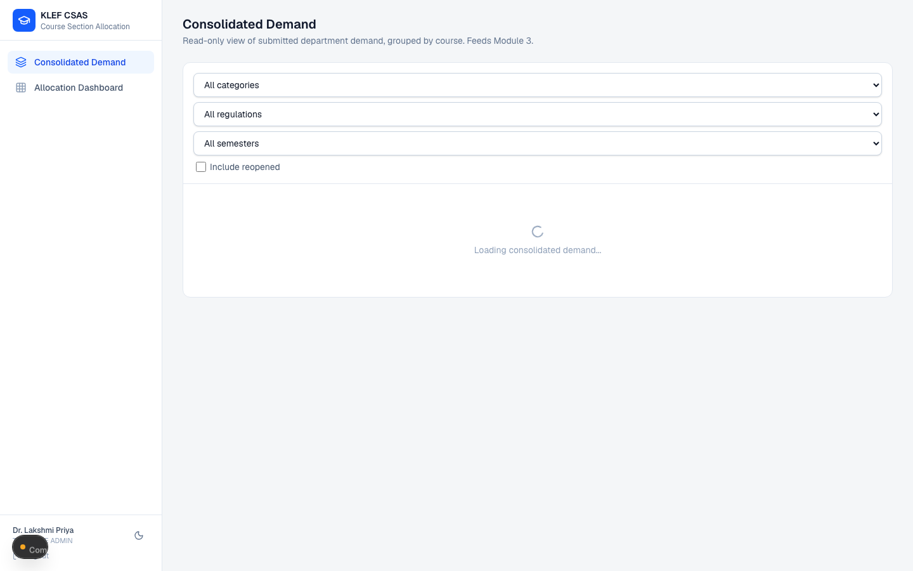

Read-only view of every submitted demand record, grouped by course and then
by department, with a Reopen action per department row. This is the
Timetable Admin's first look at what Module 2 has produced — **CSE-1,
CSE-2, CSE-3 and CSE-4 always appear as separate rows**, never merged into a
generic "CSE."

### Allocation Dashboard

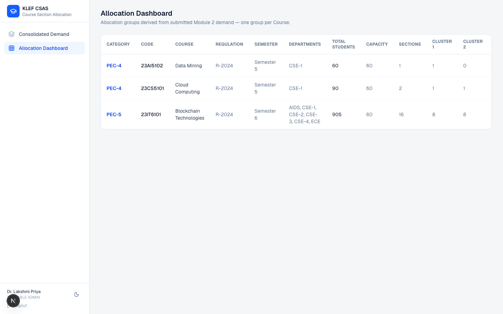

One row per **course** that has at least one submitted demand record. The
grouping key is the course itself — **same course code across departments
combines** into one allocation group (that's the whole point: Blockchain
Technologies offered by CSIT to five other departments becomes *one* group
with a combined total of 905 students across 16 sections). **Same category,
different course** (e.g. two different PEC-4 electives, Cloud Computing and
Data Mining) always stays in two separate groups with independent totals,
sections, and clusters — grouping is never done by category alone.

### Allocation detail — live calculation, matrix, and finalize

<p align="center">
  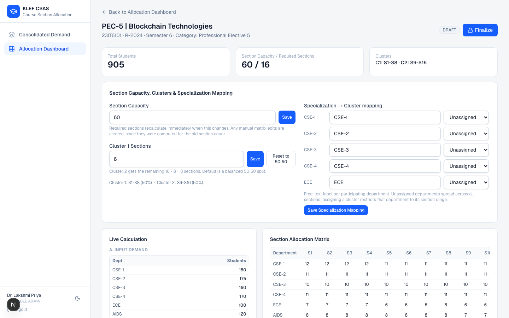
  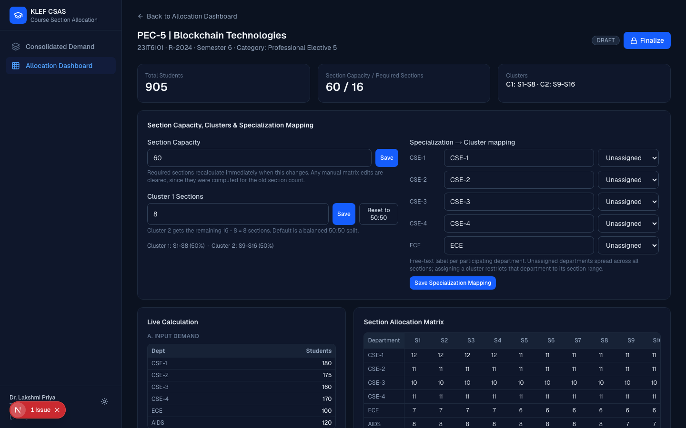
</p>

Opening a group shows, top to bottom:

1. **Section Capacity, Clusters & Specialization Mapping** — editable
   section capacity (default 60), an editable Cluster 1 section count
   (default a balanced 50:50 split, with a one-click "Reset to 50:50"), and a
   free-text specialization label per participating department mapped to
   Cluster 1 or Cluster 2 (or left **Unassigned**, which spreads that
   department across every section rather than defaulting it into Cluster 1
   and silently overflowing capacity).
2. **Live Calculation** — every step of the math shown transparently:
   input demand per department → department totals → grand total → `CEILING(total / capacity)` required sections → cluster split → per-department ratios → section-by-section utilization.
3. **Section Allocation Matrix** — a Department × Section grid. Each cell is
   editable (manual override) before finalization; editing capacity, cluster
   split, or the specialization mapping clears existing manual overrides
   automatically, because they were computed for a section layout that no
   longer exists (leaving them in place could silently under-allocate a
   department).
4. **Live Validation** — 8 checks, all of which must pass before Finalize is
   enabled: totals match, capacity not exceeded, no missing/duplicate
   allocation, no student allocated outside their assigned cluster's section
   range, the course and category are verified, and there is submitted
   demand to allocate in the first place.
5. **Finalize** — snapshots the live matrix into permanent records, stamps
   `finalizedAt`/`finalizedBy`, and writes an **AuditLog** entry. A finalized
   group is read-only. **Reopen** (also audited) puts it back into an
   editable state if something needs to change later.
6. **Reports** — six CSV exports (course-wise, category-wise,
   department-wise, allocation detail, section-wise, cluster summary) for
   downstream timetabling.

---

## Dark theme

Every screen in the app — all three modules, every modal, every status
badge and table — has a hand-verified dark variant, not just an inverted
filter. Toggle it from the icon next to the login card or in the sidebar /
mobile nav footer next to **Logout**.

- Respects the OS's `prefers-color-scheme` on first visit, then remembers an
  explicit choice in `localStorage` so it's consistent across sessions.
- A blocking init script in the root layout applies the theme class before
  first paint — no flash of the wrong theme.
- `color-scheme: light` / `dark` is set at the root so native form controls
  (checkboxes, `<select>` arrows, scrollbars) render correctly in both
  themes, not just the custom-styled parts.

<p align="center">
  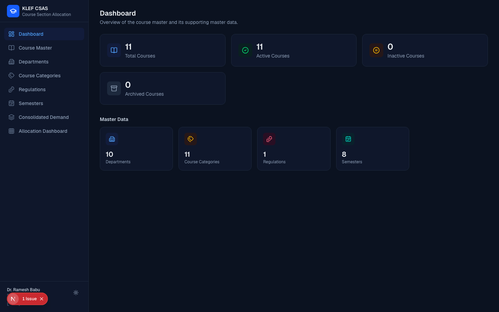
  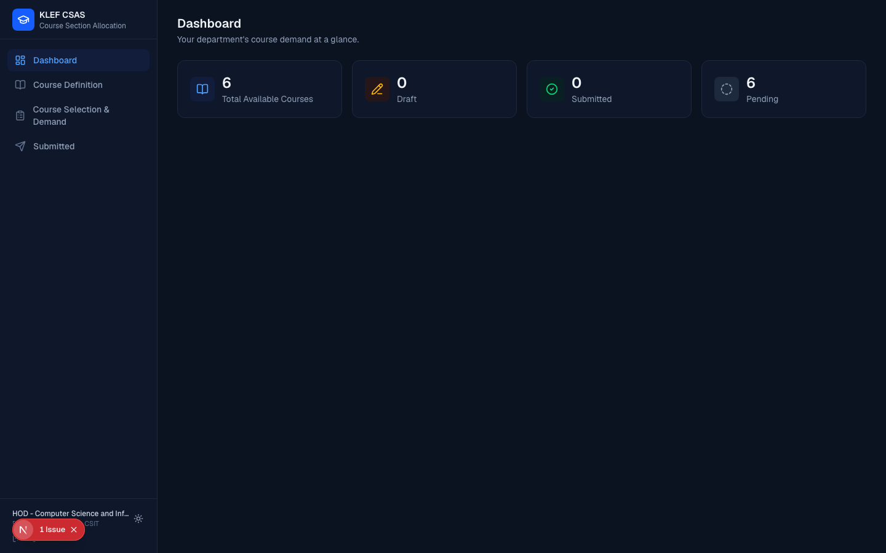
</p>

---

## Data model

Core collections (Mongoose models in `src/models/`):

- **Department** — flat, independent; no parent/child field anywhere. Same
  collection drives Module 1 "Offered By"/"Offered To," Module 2 visibility
  and scoping, Module 3 matrix rows, and department logins.
- **Course** — `offeredByDepartment` (single ref) + `offeredToDepartments`
  (array of refs), both `Department` references — never free-text names.
- **User** — `role` (`SUPER_ADMIN` / `DEPARTMENT_USER` / `TIMETABLE_ADMIN`);
  a `DEPARTMENT_USER` is required to have exactly one `department` ref
  (enforced by a schema validation hook).
- **CourseDemand** — one row per (course, department, regulation,
  semester); unique-indexed to make duplicate demand impossible; carries
  `totalStudents` directly and a `DRAFT → SUBMITTED → REOPENED` status.
- **AllocationGroup** — one row per course with submitted demand; owns
  `sectionCapacity` and `cluster1Sections` (the two levers the live
  calculation is built from) and a status ladder up to `FINALIZED`.
- **SpecializationClusterRule** — (group, department) → specialization
  label + cluster (1 or 2).
- **SectionAllocation** — (group, department, sectionNumber) → student
  count; manual overrides pre-finalize, a frozen snapshot post-finalize.
- **AuditLog** — `FINALIZED` / `REOPENED` events with actor and timestamp.

All ref models are imported for side effects from `src/lib/db/connect.ts` so
`.populate()` never hits an unregistered schema on a cold serverless start.

---

## Getting started

```bash
npm install
cp .env.example .env.local   # if present — otherwise create it, see below
npm run db:seed              # idempotent: safe to re-run
npm run dev
```

Required environment variables (`.env.local`):

```
MONGODB_URI=mongodb://127.0.0.1:27017/klef_csas
AUTH_SECRET=<any long random string>
```

`npm run db:seed` populates:

- 10 independent departments: **CSE-1, CSE-2, CSE-3, CSE-4, ECE, CSIT, AIDS,
  HTE, HTR, HTI**
- Course categories, one regulation (R-2024), 8 semesters, 5 course types
- One login per department (Module 1 + 2), one Super Admin, one Timetable
  Admin
- A handful of sample courses spanning several departments and categories,
  including a same-category / different-course pair (Cloud Computing vs.
  Data Mining, both PEC-4) to demonstrate that Module 3 keeps them separate

Useful scripts:

| Command | Purpose |
|---|---|
| `npm run dev` | Start the dev server (Turbopack) |
| `npm run build` | Production build |
| `npm run db:seed` | Seed/reset master data, users, and sample courses (idempotent upserts) |
| `npx tsc --noEmit` | Type-check |
| `npx eslint .` | Lint |

---

## Demo credentials

All seeded accounts share the password **`Password123!`**.

| Role | Email |
|---|---|
| Super Admin | `ramesh.babu@kluniversity.in` |
| Timetable Admin | `lakshmi.priya@kluniversity.in` |
| Department — CSE-1 | `hod.cse1@kluniversity.in` |
| Department — CSE-2 | `hod.cse2@kluniversity.in` |
| Department — CSE-3 | `hod.cse3@kluniversity.in` |
| Department — CSE-4 | `hod.cse4@kluniversity.in` |
| Department — ECE | `hod.ece@kluniversity.in` |
| Department — CSIT | `hod.csit@kluniversity.in` |
| Department — AIDS | `hod.aids@kluniversity.in` |
| Department — HTE | `hod.hte@kluniversity.in` |
| Department — HTR | `hod.htr@kluniversity.in` |
| Department — HTI | `hod.hti@kluniversity.in` |

These are local/demo credentials seeded by `scripts/seed.ts`. Rotate them (or
don't seed them at all) before pointing this app at a real production
database.

---

## Project structure

```
src/
  app/                    Next.js App Router pages
    (super admin pages)   /, /courses, /departments, /course-categories, ...
    department/           Module 1 + 2 pages for DEPARTMENT_USER
    admin/                Module 3 pages for TIMETABLE_ADMIN
    api/                  Route handlers (mirrors the page structure)
    login/                Public login page
  components/
    ui/                   Shared primitives (Button, Modal, FormField, Toast, ThemeToggle, ...)
    layout/                Sidebar, MobileNav, LogoutButton
    course/, master/, demand/, allocation/   Feature-specific components
  lib/
    auth/                 Session tokens, password hashing, roles, route guards
    allocation/           Pure calculation engine + matrix/validation/report builders
    demand/                Module 2 visibility + consolidation queries
    db/                    Mongoose connection singleton
    csv/                   CSV parse/validate/sample/error-report helpers
  models/                 Mongoose schemas
  proxy.ts                Route-level auth/role enforcement (Next middleware)
scripts/
  seed.ts                 Idempotent master data + demo user + sample course seed
docs/
  screenshots/            Screenshots used in this README
```

---

## Security notes

- Every write endpoint re-derives department/role from the session cookie;
  none trust a client-supplied department ID.
- Passwords are hashed with `scrypt` + a random salt, compared with a
  timing-safe check.
- Session tokens are HMAC-SHA256 signed and verified with Web Crypto so the
  same code path works in Next's Edge middleware and in server routes.
- `proxy.ts` is the single source of truth for which role can reach which
  route prefix — page components don't re-implement this logic.
